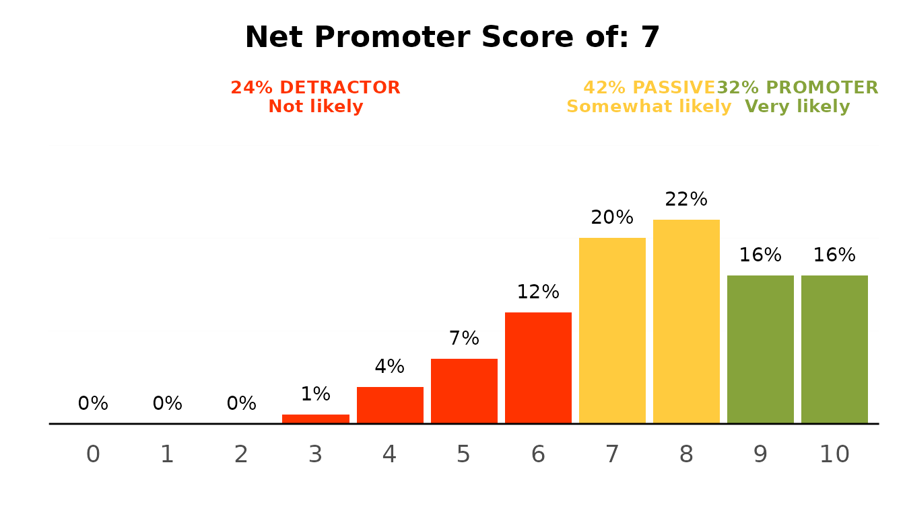
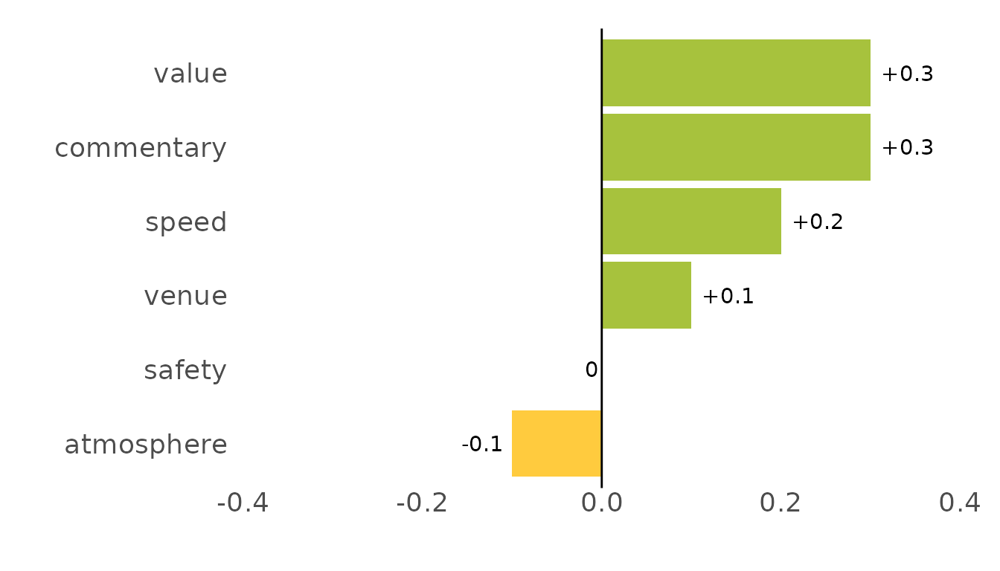

# Getting started with ezrsurvey

`ezrsurvey` turns the things consumer-survey analysts do over and over
into single-line helpers. This vignette walks through a typical analysis
of the bundled `podracing_survey` dataset: from raw answers to
percentages, models, diagnostics and a chart you could drop on a slide.

``` r

library(ezrsurvey)
#> Loading required package: dplyr
#> 
#> Attaching package: 'dplyr'
#> The following objects are masked from 'package:stats':
#> 
#>     filter, lag
#> The following objects are masked from 'package:base':
#> 
#>     intersect, setdiff, setequal, union
#> Loading required package: ggplot2
#> Loading required package: tidyr
#> Loading required package: tibble
#> Loading required package: readr
#> Loading required package: stringr
#> Loading required package: purrr
```

## The data

`podracing_survey` is 1,000 simulated respondents with demographics, a
0–10 NPS question, worded feature ratings, multi-select motivations,
brand questions and open-text comments.

``` r

podracing_survey[, c("respondent_id", "demo_gender", "demo_age", "nps_value")]
#> # A tibble: 1,000 × 4
#>    respondent_id demo_gender demo_age nps_value
#>    <chr>         <chr>          <int>     <int>
#>  1 R00001        Male              35        10
#>  2 R00002        Male              29         6
#>  3 R00003        Male              16        10
#>  4 R00004        Male              16        10
#>  5 R00005        Male              16         9
#>  6 R00006        Male              36         9
#>  7 R00007        Male              30        10
#>  8 R00008        Female            23         9
#>  9 R00009        Female            23        10
#> 10 R00010        Male              39         9
#> # ℹ 990 more rows
```

## Percentages without the `count`/`mutate`/`pivot_wider` dance

[`calc_percentage()`](https://mashud37.github.io/ezr-research/ezr-survey/reference/calc_percentage.md)
is the workhorse: counts, percentages and ordering in one call.

``` r

calc_percentage(podracing_survey, demo_gender, sort = "desc")
#> # A tibble: 3 × 3
#>   demo_gender     n   pct
#>   <fct>       <int> <dbl>
#> 1 Male          525    55
#> 2 Female        399    42
#> 3 Non-binary     27     3
```

Group with `by`, and pivot to a wide cross-tab with `wide = TRUE`:

``` r

calc_percentage(podracing_survey, satis_return, by = region, wide = TRUE)
#> # A tibble: 5 × 6
#>   region        Likely `Not sure` Unlikely `Very likely` `Very unlikely`
#>   <chr>          <dbl>      <dbl>    <dbl>         <dbl>           <dbl>
#> 1 Asia              24         25       12            34               5
#> 2 Europe            28         25       16            25               6
#> 3 Latin America     30         21       11            28              10
#> 4 North America     26         24       17            24               8
#> 5 Oceania           31         12       24            24              10
```

Check-all-that-apply questions live in a block of columns sharing a
prefix;
[`calc_percentage_multi()`](https://mashud37.github.io/ezr-research/ezr-survey/reference/calc_percentage_multi.md)
handles the per-respondent denominator for you:

``` r

calc_percentage_multi(podracing_survey, "motivations_",
                      id = respondent_id, sort = "desc")
#> # A tibble: 5 × 3
#>   option        n   pct
#>   <fct>     <int> <dbl>
#> 1 speed       772    79
#> 2 drivers     533    54
#> 3 social      437    45
#> 4 tradition   349    36
#> 5 betting     295    30
```

Spreadsheet exports, Google Forms among them, instead pack every answer
a respondent ticked into a single cell. The same function recognises
that shape and separates the answers, so you do not have to reshape
anything first:

``` r

packed <- data.frame(
  respondent = 1:4,
  motivations = c("Speed; Drivers", "Speed", "", "Betting; Speed")
)

calc_percentage_multi(packed, "motivations", id = respondent, sort = "desc")
#> # A tibble: 3 × 3
#>   option      n   pct
#>   <fct>   <int> <dbl>
#> 1 Speed       3   100
#> 2 Betting     1    33
#> 3 Drivers     1    33
```

Note the denominator: three respondents ticked something, so “Speed” is
3 of 3. When you need those answers as columns rather than as a table,
for a crosstab or a filter,
[`split_multi()`](https://mashud37.github.io/ezr-research/ezr-survey/reference/split_multi.md)
widens them:

``` r

split_multi(packed, motivations)
#> # A tibble: 4 × 5
#>   respondent motivations      motivations_Speed motivations_Betting
#>        <int> <chr>            <chr>             <chr>              
#> 1          1 "Speed; Drivers" "Speed"           ""                 
#> 2          2 "Speed"          "Speed"           ""                 
#> 3          3 ""               ""                ""                 
#> 4          4 "Betting; Speed" "Speed"           "Betting"          
#> # ℹ 1 more variable: motivations_Drivers <chr>
```

## Reusable level orders

Rather than retyping `levels = c(...)`, register an order once and link
it to a variable;
[`calc_percentage()`](https://mashud37.github.io/ezr-research/ezr-survey/reference/calc_percentage.md)
then applies it automatically.

``` r

register_order(
  "education",
  levels = c("Primary or less", "Lower secondary", "Upper secondary",
             "Short-cycle tertiary", "Bachelor or equivalent",
             "Master or equivalent", "Doctoral or equivalent"),
  vars = "demo_edu"
)

calc_percentage(podracing_survey, demo_edu)
#> # A tibble: 7 × 3
#>   demo_edu                   n   pct
#>   <ord>                  <int> <dbl>
#> 1 Bachelor or equivalent   244    25
#> 2 Doctoral or equivalent    35     4
#> 3 Lower secondary          111    11
#> 4 Master or equivalent     122    13
#> 5 Primary or less           42     4
#> 6 Short-cycle tertiary     123    13
#> 7 Upper secondary          295    30
```

## Net Promoter Score

``` r

calc_nps(podracing_survey, nps_value)
#> # A tibble: 1 × 8
#>       n   nps pct_detractors pct_passives pct_promoters detractors passives
#>   <int> <dbl>          <dbl>        <dbl>         <dbl>      <int>    <int>
#> 1  1000     7             25           43            32        252      426
#> # ℹ 1 more variable: promoters <int>
```

``` r

plot_nps(podracing_survey, nps_value)
```



## Importance / performance

[`ipm_model()`](https://mashud37.github.io/ezr-research/ezr-survey/reference/ipm_model.md)
combines driver importance (by default, relative weights against the NPS
score) with feature performance;
[`plot_ipm()`](https://mashud37.github.io/ezr-research/ezr-survey/reference/plot_ipm.md)
draws the matrix. Pass `method = "forest"` for a random-forest
cross-check, which sees non-linear effects that relative weights cannot.

``` r

model <- ipm_model(podracing_survey, nps_value, "ratings_")
#> Parsing `nps_value` as a non-binary variable.
#> Applying multiple regression to calculate relative weights...
model
#> # A tibble: 6 × 4
#>   feature    importance performance perf_class
#>   <chr>           <dbl>       <dbl> <fct>     
#> 1 value           24.9         2.86 2         
#> 2 atmosphere      23.8         3.57 3         
#> 3 speed           18.0         3.48 3         
#> 4 safety          14.1         2.88 2         
#> 5 venue           12.2         3.08 3         
#> 6 commentary       6.99        2.58 2
```

## Comparing two events

For event surveys you often compare this wave with the last.
[`compare_values()`](https://mashud37.github.io/ezr-research/ezr-survey/reference/compare_values.md)
computes the differences and
[`plot_diff()`](https://mashud37.github.io/ezr-research/ezr-survey/reference/plot_diff.md)
draws the change chart.

``` r

previous <- transform(model, performance = performance - c(.3, -.1, .2, 0, .1))
#> Warning in performance - c(0.3, -0.1, 0.2, 0, 0.1): longer object length is not
#> a multiple of shorter object length
compare_values(model, previous) %>%
  plot_diff()
```



## How precise is it?

[`diagnose()`](https://mashud37.github.io/ezr-research/ezr-survey/reference/diagnose.md)
reports the standard error, relative standard error and margin of error
for any column – numeric (point) or categorical (proportion).

``` r

diagnose(podracing_survey, demo_gender, nps_value)
#> # A tibble: 2 × 9
#>   variable    type  unit       n estimate    se   rse   moe precision     
#>   <chr>       <chr> <chr>  <int>    <dbl> <dbl> <dbl> <dbl> <chr>         
#> 1 demo_gender prop  ppt      951    55.2   1.61  2.92  3.16 high precision
#> 2 nps_value   mean  points  1000     7.56  0.06  0.74  0.11 high precision
```

For a one-shot, plain-language read on the whole study,
[`precision_summary()`](https://mashud37.github.io/ezr-research/ezr-survey/reference/precision_summary.md)
picks the point-scale and proportion variables for you and writes the
bullet points you would otherwise hand-craft for a report appendix:

``` r

precision_summary(podracing_survey)
#> Survey precision summary
#> - Based on 1,000 total responses (per-question base of 776 to 1,000).
#> - Point ratings carry a sampling margin of about +/-0.40 points (up to +/-0.69) at 95% confidence.
#> - Percentages carry a sampling margin of about +/-3.0 percentage points (worst case +/-3.1 at a 50/50 split).
#> - Overall relative standard error of about 4.2% -- high precision.
```

### Why relative standard error?

A standard error on its own is hard to judge – is `±0.05` good? It
depends on the scale. The **relative standard error** (RSE) divides the
standard error by the estimate, so precision becomes comparable across a
1–5 rating and a percentage alike. Rating estimates by their RSE is the
approach national statistical agencies use to decide whether a number is
solid enough to publish. The [Australian Bureau of
Statistics](https://www.abs.gov.au/statistics/microdata-tablebuilder/tablebuilder/confidentiality-and-relative-standard-error),
for example, treats an RSE of 25% or more as not reliable for most
purposes, marks estimates between 25% and 50% with an asterisk as ones
to use with caution, and suppresses anything above 50%. ezrsurvey keeps
that 25% boundary and adds tighter bands below it, because in
consumer-survey work the question is usually which of several adequately
precise numbers to lead with:

| RSE         | Rating                    |
|-------------|---------------------------|
| under 5%    | high precision            |
| under 10%   | precise                   |
| under 15%   | satisfactory              |
| under 25%   | use with caution          |
| 25% or more | likely reliability issues |

For proportions, the margin of error is widest at a 50/50 split
(`sqrt(0.5 * 0.5 / n)`), so a single worst-case `±` percentage-point
figure at your achieved sample size bounds every percentage in the study
– which is why
[`precision_summary()`](https://mashud37.github.io/ezr-research/ezr-survey/reference/precision_summary.md)
reports it.

## Saving and exporting

Every table and plot has a one-line, pipe-friendly save. A bare file
name lands in an `ezrsurvey-outputs/` folder, created on demand, so a
script’s results collect in one place instead of scattering through the
working directory; pass a path with a directory in it
(`"./gender.xlsx"`, `"tables/gender.xlsx"`, anything absolute) to put a
file exactly where you want it. The first save of a session says which
folder it used, so nothing goes missing.

``` r

calc_percentage(podracing_survey, demo_gender) %>% save_data("gender.xlsx")
plot_nps(podracing_survey, nps_value) %>% save_plot("nps.png")

# several tables, one tab each
export_xlsx(
  gender = calc_percentage(podracing_survey, demo_gender),
  job    = calc_percentage(podracing_survey, demo_job),
  path   = "summary.xlsx"
)
```

## Where to next

- Set persistent defaults with
  [`ezrsurvey_options()`](https://mashud37.github.io/ezr-research/ezr-survey/reference/ezrsurvey_options.md)
  and a profile
  ([`use_ezrsurvey_profile()`](https://mashud37.github.io/ezr-research/ezr-survey/reference/use_ezrsurvey_profile.md)).
- Build a deck with
  [`report_deck()`](https://mashud37.github.io/ezr-research/ezr-survey/reference/report_deck.md)
  or scaffold a Quarto report with
  [`scaffold_report()`](https://mashud37.github.io/ezr-research/ezr-survey/reference/scaffold_report.md),
  which drops the `.qmd` beside where its render will land.
- Draft the narrative around the tables with the companion
  `ezrintelligence` package.
